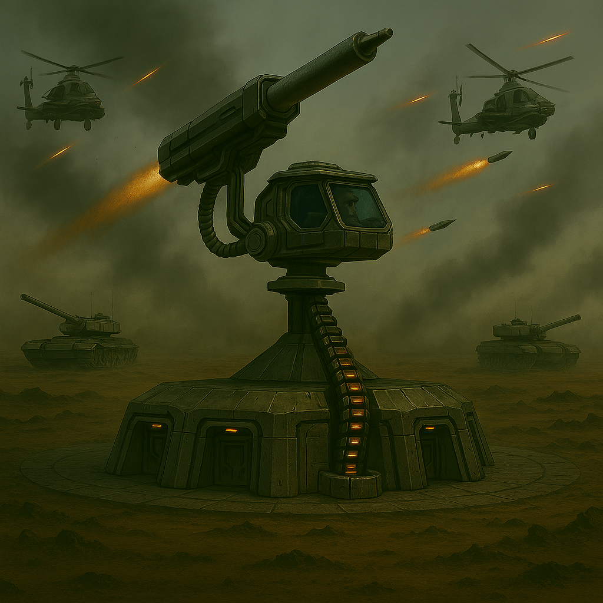

# ZeGunner - Unity 3D Base Defense Game



A Unity 3D Base defense game where players defend their base from incoming enemy tanks and helicopters using a turret-based rocket system.

## Project Overview

ZeGunner is a 3D first-person tower defense game built in Unity. Players control a turret/cannon positioned on a base and must destroy waves of enemy tanks and helicopters before they reach the base. The game features realistic tank models, explosive effects, dynamic enemy movement, and a comprehensive scoring system.

## 🎮 Demo Video

[](https://youtu.be/aaY77fafaHQ)

**Watch the full gameplay demonstration:** [https://youtu.be/aaY77fafaHQ](https://youtu.be/aaY77fafaHQ)

## Free Components Used

### 3D Models & Assets
- **Tank 3D Model** - Military tank with detailed textures and moving parts
  - Source: Unity Asset Store (Free)
  - Location: `Assets/Isle of Assets/Tank 3D Model/`
  - Includes: Tank prefab, materials, textures

### Visual Effects
- **WarFX Explosion Pack** - Professional explosion effects and particle systems
  - Source: Unity Asset Store (Free)
  - Location: `Assets/JMO Assets/WarFX/`
  - Includes: Multiple explosion prefabs, smoke effects, particle systems

### Audio Assets
- **Grenade Sound FX** - Realistic explosion sound effects
  - Source: Free sound pack
  - Location: `Assets/Grenade Sound FX/Grenade/`
  - Includes: 10 different explosion sound variations

### Unity Systems
- **Unity Input System** - Modern input handling for keyboard and mouse
- **Unity Particle System** - Built-in particle effects for explosions
- **Unity UI System** - Score display and game interface
- **Unity Physics** - Collision detection and projectile physics

## Game Features

### Core Gameplay
- **First-person turret control** with mouse aiming and sensitivity adjustment
- **Vertical camera movement** using W/S keys with height limits
- **Advanced projectile system** with sphere and rocket options
- **Dynamic enemy spawning** with tanks and helicopters
- **Wave-based progression** with increasing difficulty
- **Collision detection** for accurate enemy destruction
- **Enemy firing system** - tanks and helicopters fire when in range
- **Screen flash warnings** for off-screen threats

### Enemy AI & Movement
- **Snake-like tank movement** with unique patterns per tank
- **Helicopter zigzag flight** with lateral sliding movement
- **Distance-based zigzag activation** for helicopters
- **Speed progression system** with min/max limits per wave
- **Smart enemy targeting** - enemies face base while moving

### Visual & Audio
- **Dynamic explosion effects** with fallback particle systems
- **Random explosion sounds** for variety
- **Global volume control** with 5% increments
- **3D spatial audio** positioned at explosion locations
- **Volume-controlled firing sounds** respecting global settings
- **Smart rendering pipeline compatibility** (detects and fixes purple materials)

### UI & Systems
- **Real-time score tracking** with wave progression
- **Statistics display** (enemies destroyed, accuracy, longest distance)
- **Enemy reach base counter** with game over conditions
- **Modern TextMeshPro UI** with consistent styling
- **Volume and sensitivity displays** with center-screen positioning
- **Wave management system** with automatic progression

## Technical Implementation

### Key Scripts
- **`CannonController.cs`** - Turret control, camera movement, projectile firing
- **`TankSpawner.cs`** - Enemy tank spawning with wave progression
- **`HelicopterSpawner.cs`** - Helicopter spawning with zigzag movement
- **`Tank.cs`** - Snake-like movement, firing, and collision detection
- **`Helicopter.cs`** - Zigzag flight, lateral movement, and firing
- **`WaveManager.cs`** - Wave progression and enemy speed management
- **`ScoreManager.cs`** - Game statistics, scoring, and base health
- **`VolumeManager.cs`** - Global audio control with UI display
- **`MouseSensitivityManager.cs`** - Mouse sensitivity with UI display
- **`ScreenFlash.cs`** - Visual warning system for off-screen threats
- **`ExplosionManager.cs`** - Explosion effects and audio management
- **`RocketCollision.cs`** - Projectile collision and enemy destruction

### Architecture
- **Singleton patterns** for managers (ScoreManager, ExplosionManager)
- **Component-based design** for modular functionality
- **Event-driven scoring** system
- **Resource loading** for audio and effects
- **Automatic fallback systems** for rendering compatibility

## Controls

### Combat & Movement
- **Mouse** - Aim turret/cannon
- **Left Click** - Fire projectile
- **W Key** - Move camera/turret up
- **S Key** - Move camera/turret down (with minimum height limit)
- **SPACE or Right Click** - Start next wave (when wave complete)
- **ESC** - Pause/Exit game

### Settings & Adjustments
- **+/- Keys** - Adjust mouse sensitivity (with UI display)
- **, . or < > Keys** - Control master volume (5% increments)
- **T Key** - Test mouse sensitivity display (debug)

### Visual Indicators
- **Red Screen Flash** - Enemy reached firing range while off-screen
- **Volume Display** - Shows current volume level when adjusting
- **Sensitivity Display** - Shows current sensitivity when adjusting

### Game Settings
- **Enemy Speed Limits** - Configurable min/max speed per wave
- **Spawn Distance Increments** - Progressive enemy spawn distances
- **Zigzag Movement** - Adjustable enemy movement patterns
- **Wave Difficulty** - Progressive enemy count and speed increases

## Project Structure

```
Assets/
├── Scripts/                    # C# game scripts
├── Enemies/                    # Tank prefabs
├── Resources/                  # Runtime-loaded assets
├── JMO Assets/                 # WarFX explosion effects
├── Grenade Sound FX/          # Explosion audio
├── Isle of Assets/            # Tank 3D models
└── Scenes/                    # Game scenes
```

## Setup Instructions

1. **Open in Unity** - Requires Unity 2021.3 or later
2. **Import Assets** - All free components included in project
3. **Configure Scene** - TankSpawner and ExplosionManager are pre-configured
4. **Play Game** - Ready to play with default settings

## Compatibility

- **Unity Version**: 2021.3 LTS or later
- **Render Pipeline**: Compatible with Built-in, URP, and HDRP
- **Platform**: Windows, Mac, Linux
- **Input**: Mouse and Keyboard

## Notes

- The game includes automatic material fixing for rendering pipeline compatibility
- Explosion effects use intelligent fallback systems for visual consistency
- Enemy movement systems feature unique patterns per enemy for variety
- All audio systems respect global volume controls for consistent user experience
- Modern UI systems use TextMeshPro for crisp, scalable text rendering
- All assets are free-to-use with appropriate licensing
- Project demonstrates advanced Unity development patterns including:
  - Singleton manager patterns
  - Component-based architecture
  - Event-driven systems
  - Modern Input System integration
  - Progressive difficulty systems
  - Dynamic enemy AI with varied movement patterns

---

**Developed with Unity 3D using free asset store components**
